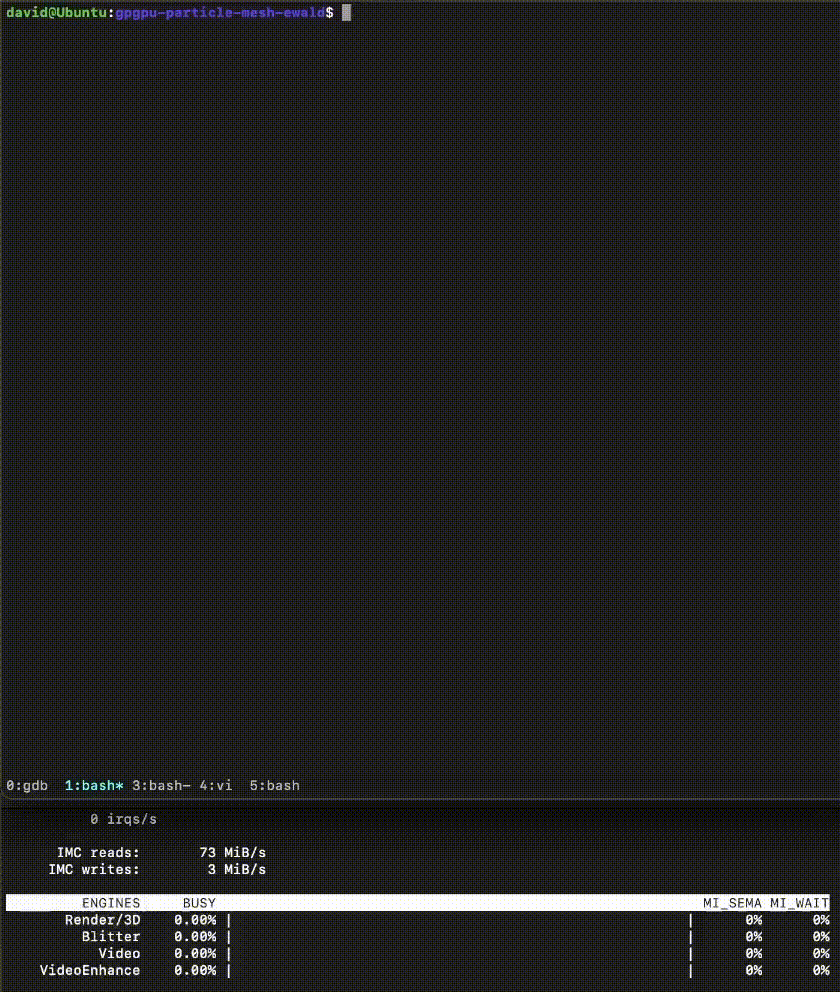

# GPGPU-Intel
## Overview
gpgpu-intel is a minimal userspace driver for general purpose computation on Intel GPUs.
It is based on reverse engineering Intels [NEO Compute Runtime](https://github.com/intel/compute-runtime) for OpenCL and extracts its core functionality. 
While Intels driver is about 200000 lines of C++, this driver has 6500 lines. Its core features include:
- Immediate execution of arbitrary compute kernels
- Support for all address space qualifiers (global, constant, local, private)
- Support for memory barriers
- Save compiled kernel binaries into file

Not included are:
- Event-based kernel execution
- doesn't support the following kernel argument specifiers: image, sampler, queue, ...

## Installation
Building and running this driver requires
- Intel Processor with integrated GEN8, GEN9 or GEN11 GPU (GEN12 and Xe not yet supported)
- Linux distribution of your choice

This driver links against the [Intel Graphics Compiler (IGC)](https://github.com/intel/intel-graphics-compiler). On Ubuntu it can be installed with
```sh
sudo apt install libigc-dev libigc1 libigdfcl-dev libigdfcl1
```
Alternatively, there are release builds available [here](https://github.com/intel/intel-graphics-compiler/releases).
Compile this driver by doing the following:
```sh
git clone https://github.com/dprekel/gpgpu-intel.git
cd gpgpu-intel/driver
make DEBUG=1 INFO=1
sudo make install
```
This creates a shared library `libigpgpu.so` and installs it in `/usr/local/lib`. `DEBUG=1` compiles with debug symbols and console logging, `INFO=1` will print device info to the console when running an application.

## Documentation
The API documentation can be found [here](https://dprekel.github.io/html/gpgpu__api_8h.html).


## Driver Internals

The batchbuffer is then put into a ring buffer by the kernel driver so that the Command Streamer Engine of the GPU can directly access it by DMA. The Command Streamer then executes the commands one by one.

## Examples


## ToDo
- Add support for GEN12 and Xe Graphics
- Once an application has issued a couple of dozen kernel executions (depends on kernel), some buffer objects will overflow, needs to be fixed

## Links
[Intel Graphics Hardware documentation](https://www.intel.com/content/www/us/en/docs/graphics-for-linux/developer-reference/1-0/overview.html)

[WikiChip about GEN9 hardware](https://en.wikichip.org/wiki/intel/microarchitectures/gen9.5)

[Debug a GPU kernel with gdb](https://www.intel.com/content/www/us/en/docs/distribution-for-gdb/get-started-guide-linux/2023-0/overview.html)

[How to build a simple GPU in Verilog](https://github.com/adam-maj/tiny-gpu)


